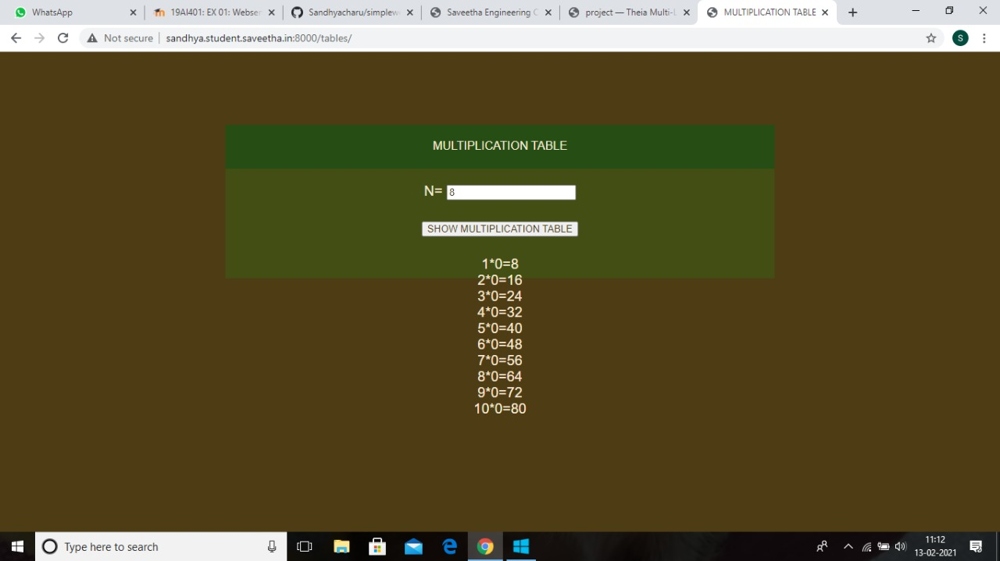
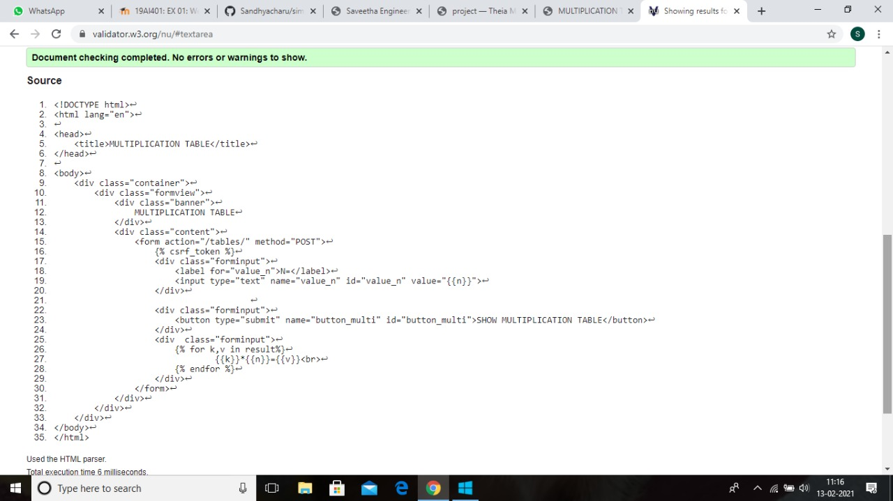

# Developing a Simple Webserver
## AIM:
To develop a simple webserver to serve html pages.

## DESIGN STEPS:
### Step 1: 
HTML content creation
### Step 2:
Design of webserver workflow
### Step 3:
Implementation using Python code
### Step 4:
Serving the HTML pages.
### Step 5:
Testing the webserver

## PROGRAM:

### tables.html
```

<!DOCTYPE html>
<html>

<head>
    <title>MULTIPLICATION TABLE</title>
    <link rel="stylesheet" href="">
</head>

<body>
    <div class="container">
        <div class="formview">
            <div class="banner">
                MULTIPLICATION TABLE
            </div>
            <div class="content">
                <form action="/tables/" method="POST">
                    
                    <div class="forminput">
                        <label for="value_n">N=</label>
                        <input type="text" name="value_n" id="value_n" value="{{n}}">
                    </div>
                                       
                    <div class="forminput">
                        <button type="submit" name="button_multi" id="button_multi">SHOW MULTIPLICATION TABLE</button>
                    </div>
                    <div  class="forminput">
                        
                                {{k}}*{{n}}={{v}}<br>
                        
                    </div>
                </form>
            </div>
        </div>
    </div>
</body>
</html>
```

### tables.css
```
*{
      box-sizing: border-box;
      font-family: Arial, Helvetica, sans-serif;
      color: antiquewhite;
}

body, html{
    margin-top: 0px;
    margin-right: 0px;
    margin-bottom: 0px;
    margin-left: 0px;
    padding-top: 0px;
    padding-right: 0px;
    padding-bottom: 0px;
    padding-left: 0px;
    background-color: #4E3C14;
}

.container{
    width: 750px;
    margin-left: auto;
    margin-right: auto;
}

.formview{
    justify-content: center;
    margin-top: 100px; 
}

.forminput{
    height: 50px;
    padding-top: 20px;
    font-size: larger;
}

.banner{
    display: block;
    width: 100%;
    background-color: #264E14;
    padding-top: 20px;
    text-align: center;
    height: 60px;
}

.content{
    display: block;
    width: 100%;
    background-color: #434E14;
    text-align: center;
}

input{
    color: #4E3C14;
}
button{
    color: #4E3C14;
}
```
## OUTPUT:


## CODE VALIDATION REPORT:


## RESULT:
Thus a website is designed for the multiplication tables and is hosted in the URL http://sandhya.student.saveetha.in:8000/. HTML code is validated.


